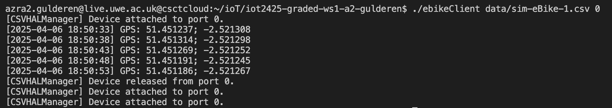

# IoT eBike Fleet Monitoring System

## Overview

This project implements an IoT system to monitor an eBike fleet. The solution is divided into two main activities:

1. **Activity 1:**  
   Develop a simulated GPS sensor (`GPSSensor`) and an eBike client application (`ebikeClient`). The client reads GPS data from a CSV file and outputs the data in a specified format.

2. **Activity 2:**  
   Create unit tests (using the Catch2 framework) to verify that the simulated GPS sensor and the eBike client function as expected.

## Project Structure


## Code Explanations

### Activity 1: Simulated GPS and eBikeClient

- **GPSSensor:**  
  In `src/GPSSensor.h`, the `GPSSensor` class simulates a GPS sensor by reading a row from a CSV file. Its `format` method splits the CSV row at the comma and returns a formatted string in the form:  

Timestamps are included in the GPS output to show when each reading was taken. This provides additional context (such as the sequence and timing of events) during execution and debugging. The output format is as follows:




- ### **eBikeClient:**
In `src/ebikeClient.cpp`, the function `runEbikeClient`:
1. Initializes a `CSVHALManager` with the provided CSV file.
2. Attaches the `GPSSensor` to a specified port (printing a device attach message).
3. Reads five GPS readings from the CSV file (each reading is printed on its own line).
4. Releases the sensor (printing a release message).
5. Attaches the sensor two more times so that a total of **three attach messages** are printed.

This function captures all output (using an `ostringstream`) and returns it as a string for verification in tests.

### Activity 2: Unit Testing

- **Unit Tests:**  
Unit tests are implemented using the Catch2 framework in the `tests/` directory.
- `test_GPSSensor.cpp` verifies that `GPSSensor` returns the correct ID and dimension and that its `format` method outputs the expected string.
- `test_ebikeClient.cpp` calls `runEbikeClient` (using a real CSV file, e.g., `data/sim-eBike-1.csv`) and checks that:
  - There are 3 attach messages,
  - There is 1 release message,
  - There are 5 GPS readings,
  - The output contains specific CSV values (e.g., `"51.451237"` for latitude and `"-2.521308"` for longitude),
  - And the order of messages is correct.

**Note:** Only one test file (e.g., `test_GPSSensor.cpp`) should define `#define CATCH_CONFIG_MAIN` to generate the test main function.

# How To Run

### *Building the Project*

```markdown

Building the Project

make clean 
make 

Running Activity 1 (Main Application)

./ebikeClient data/sim-eBike-1.csv 0

Running Activity 2 (Unit Tests)

make test 

./test_ebikeClient -s

CSV File Generation

./generateEBikeFile 77523 1 5

```


## Challenges and Key Learnings ##

### *Output Formatting:*
Matching the exact output (e.g., the device attach/release messages and GPS readings) was challenging. Small differences in formatting (like extra timestamps) required adjustments in the code.

### *Unit Testing with Catch2:*
I learned how to capture and verify program output using Catch2, and how to organize tests in separate files while managing a single main function.

### *Modular Code Design:*
Separating the hardware abstraction (CSVHALManager), sensor functionality (GPSSensor), and client logic (runEbikeClient) made the code more maintainable and testable.
